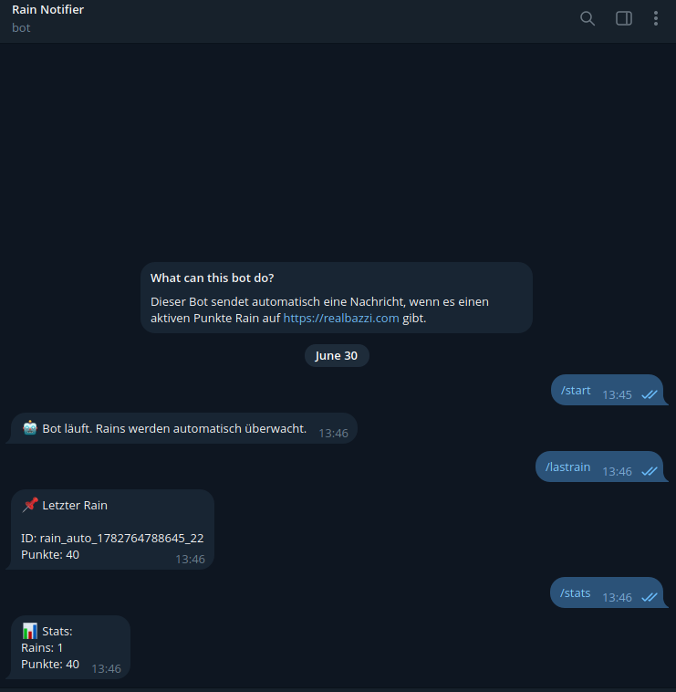

# Rain Monitor Telegram Bot

Ein Telegram Bot, der den Punkte Rain auf https://realbazzi.com trackt und automatisch benachrichtigt, wenn ein Rain aktiv ist.

## 🚀 Installation

Dieser Bot läuft in einem Docker Container. Wenn du nicht weißt, wie man ihn zum Laufen bekommt, rate ich dir von der Benutzung ab.
Solltest du die Funktion trotzdem nutzen möchten, empfehle ich dir [diesen Bot](https://t.me/BazziNotifierBot) (durch die Nutzung des bestehenden Bots sinkt die Gefahr gebannt zu werden auf 0)

## ✨ Features

- Trackt ob ein Punkte Rain aktiv ist
- Benachrichtigt, wenn ein Rain aktiv
- Liefert kleine Statistik seit Deployement
- MySql Log System
- Last Rain Übersicht
- Selfhosting, keine unnötige Tracker

## Nutzung

1. **.env anpassen**
   - Passe die .env nach deinen Wünschen an (API_URL wurde absichtlich entfernt, diese musst du selber herausfinden. Ist nicht so schwer)

3. **Bot Deployen**: 
   - Docker-Compose.yml mit "docker compose up --build -d" deployen (-d startet den Bot im Hintergrund)

4. **Commands**:
   - /start - Startet den Bot
   - /stats - Liefert eine kleine Statistik welche seit dem Aufsetzen des Bots die Rains trackt
   - /lastrain - Zeigt Info über den letzten Rain

## Wie es Funktioniert

- Der Bot überwacht die API und meldet, wenn sich diese geändert hat
- Logs werden in einer MySql Datenbank gespeichert, damit /stats und /lastrain funktionieren und es keine doppelte Benachrichtigung gibt

## Datenspeicherung

- **MySql**: Es werden Informationen über die Rains und User gespeichert (Rain id, Punkte Anzahl, Dauer in Sekunden, Start-/Endzeit des Rains und die Telegram User ID)

## Datenschutz und Sicherheit

- Alle Daten werden von der Seite direkt ausgelesen
- Bot sieht keine Cookies, Login Token oder andere sensitive Daten
- Kein extra Login notwendig
- Es werden ausschließlich Anfragen an die Website (API) gesendet

## Disclaimer

Ich übernehme keine Haftung für gebannte Accounts, Datenverluste, Konsequenzen oder andere Schäden. Dieses Tool dient ausschließlich zu Schulungs- und Demonstrationszwecken.
Dieses Tool und der Account stehen in keiner offiziellen Vebindung mit [realbazzi.com](https://realbazzi.com) oder dem Streamer [Real_Bazzi](https://www.twitch.tv/real_bazzi)
Die Nutzung erfolgt auf eigene Verantwortung.
Alle Rechte vorbehalten.
